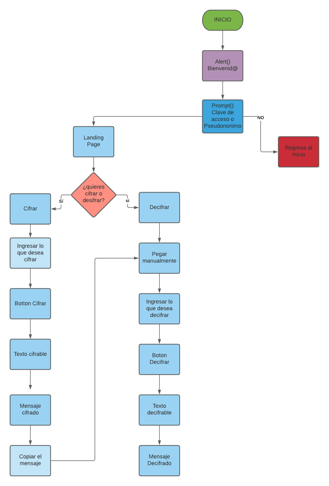
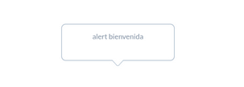
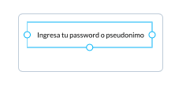
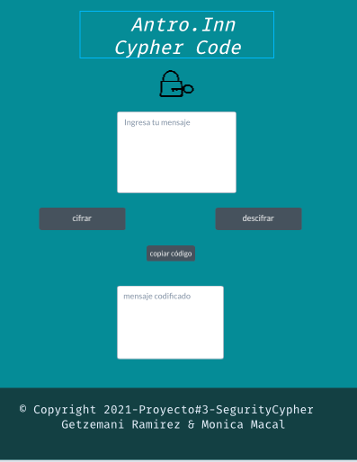
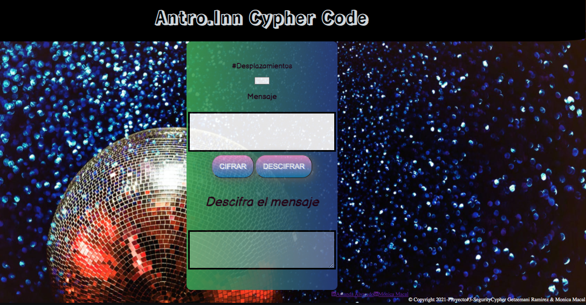

# 03_SecurityCypher

---
Índice

 1. Descripción
 2. Historias de Usuario
 3. Diagrama de flujo
 4. UI
 5. Pseudocódigo
 6. Lenguajes Utilizados

---

## 1. Descripción

Se presenta el prototipo de  una aplicación móvil que también funciona en el ordenador; esta app está basada en el "cifrado César" y con ella se podrá codificar y decodificar mensajes.

---

## 2. User Definition

La aplicación esta dirigida al personal de seguridad de un antro,  en ella el personal de seguridad se  puede comunicar entre sí, para aumentar/mejorar la seguridad del sitio.
Cada miembro del staff cuenta con un password o "pseudónimo" para acceder.

---

## 3. Diagrama de flujo



---

## 4. UI(user interface)

#### Window 1 


#### Window 2 


#### Window 3 


#### Window 4



---

## 5. Pseudocódigo

**Problema:** Recientemente los antros han registrado fallas en la seguridad, debido a que entran muchas personas es necesario contar con un control y mayor organización dentro y fuera del lugar, para evitar robos y conflictos dentro del lugar.Por ello es necesario que todo el personal de seguridad cuente con un sistema de comunicación interno.

**Solución:** Presentamos una página cuya funcion es  cifrar y decifrar mensajes a los cuales solo pueden tener acceso el personal de confianza del antro mediante una  contraseña. Esta puede ser utilizada en celulares y computadoras

**Implementación:** Se utilizará el método del "Cifrado César" (utilizaremos una formula para convertir texto a lenguaje númerico con el código ASCII) para codificar y decodificar los mensajes que el usuario ingrese en la página.


## Seccion HTML

 ```html
 <textarea id="textArea">We are learning to copy text to clipboard in JavaScript.</textarea>
    <button onclick="copyToClipBoard()">Copy</button>
```
- Crear función cipher que por medio de la formula ( x + n) % 26 ayude a encriptar el string de usuario e imprima el resultado en html. Asi mismo, crear funcion decipher para descifrar string dado por usuario e imprimir resultado en html.

## Seccion JavaScript

``` JS
Alert "Ingresa tu clave de acceso o Pseudónimo"
```

``` js
Prompt Confirm
"Clave correcta" --> Alert "Continuar"
if else 
"Clave incorrecta" --> Alert "Acceso Denegado"
```

### Regresa al inicio

``` js
Funcion // Codificar caracteres ingresados
```

``` js
input 1 // Texto decifrable
```

Boton

+ Cifrar
+ Decifrar

```js
Input 2 // Mensaje cifrado
```

Boton

+ Copiar texto

``` js
function copyToClipBoard() {

    var content = document.getElementById('textArea');
    
    content.select();
    document.execCommand('copy');

    alert("Copied!");
}
```

``` js
botonCifrar.addEventListener("click", () => 
let string = document.getElementById('mensajeuno').value;
let offset = document.getElementById('desplazamientos').value;

``` 

## Seccion JavaScript Cipher
 
``` js
     window.cipher = {
         encode: function encode (offset,string){ 
            
            decode: function decode (offset,string){
```    


---

## 6.  Lenguajes Utilizados

+ HTML5
+ CSS
+ JavaScript

---
## 7. Testing

Al iniciar la página muestra un "alert" que te pide la contraseña que es: 123

Si el user coloca un password incorrecto, la interfaz se esconde.


---

## 9.  CopyRight

© Copyright 2021-Proyecto#3-SegurityCypher  Getzemani Ramirez & Monica Macal

